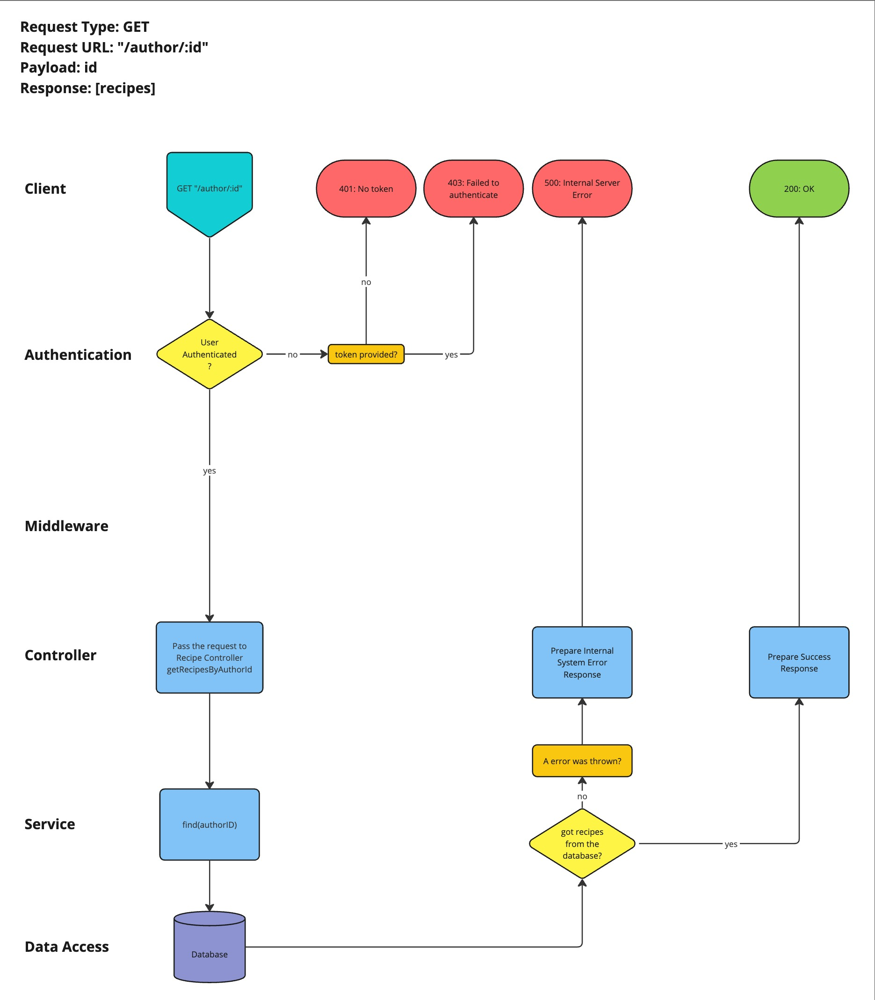

# Open Kitchen

Open Kitchen is a full-stack application designed to unite food enthusiasts from around the world. This platform empowers users to share and explore an different variety of recipes, fostering a global community of culinary creativity. Whether you're a seasoned chef eager to showcase your signature dishes or an amateur cook looking for new inspiration, Open Kitchen offers a dynamic space to connect, learn, and share. Users can freely browse a diverse collection of recipes contributed by fellow enthusiasts, enriched with detailed ingredients, step-by-step instructions, and enticing images.

[**Hosted Version**](https://openkitchen-app.netlify.app/)

- [Running the app on your machine](#running-the-open-kitchen-app)
- [Tech Stack](#tech-stack)
- [User stories](#user-stories)
- [Trello Board](#trello-board)
- [Frontend component hierarchy](#frontend-component-hierarchy)
- [Backend routes diagram](#routes-diagrams)

## Running the Open Kitchen App

1. Clone the repo

```bash
git clone https://github.com/fabiodplacerda/Open-Kitchen.git
```

2. Navigate to the project directory.

```bash
cd Open-kitchen
```

3. Install frontend dependencies

From the root folder:

```bash
cd frontend
npm install
```

4. Install backend dependencies

From the root folder:

```bash
cd backend
npm install
```

5. run the server from the backend

From the backend folder:

```bash
npm run start
```

6. run the server from the backend

From the frontend folder:

```bash
npm run dev
```

[return to index](#open-kitchen)

## Tech Stack

**Frontend**

- React
- Axios
- Material UI
- Bootstrap
- Popperjs/core
- React toastify
- React slick

**Backend**

- Express
- Node.js
- Mongoose
- Bcrypt
- Json Web Token
- Cors
- Dotenv
- Express-validator

**Dev dependencies**

- Testing-library/jest-dom
- Testing-library/react
- Testing-library/user-event
- Vitest
- Vitest Coverage Istanbul
- Jsdom
- C8
- Chai
- Mocha
- Sinon
- Supertest

[return to index](#open-kitchen)

## User Stories

### User Story 1: Register

**As a** user,\
**I want to be able** to Register for an account,\
**So that I can** create a personal profile and access personalized features.

### User Story 2: Login

**As a** user,\
**I want to be able** to log in to my account,\
**So that I can** access additional features available to registered users.

### User Story 3: Change Password

**As a** user,\
**I want to be able** to change my password,\
**So that I can** improve my account security.

### User Story 4: Delete Account

**As a** user,\
**I want to be able** to delete my account,\
**So that I can** delete all my data from the website.

### User Story 5: View Recipes

**As a** user,\
**I want to be able** to view recipes,\
**So that I can** I can view them in more detail.

### User Story 6: Add to Recipe

**As a** user,\
**I want to be able** to add a new recipe,\
**So that I can** I can share my recipe with other users.

### User Story 7: Edit Recipe

**As a** user,\
**I want to be able** to edit my own recipe,\
**So that I can** I can keep my recipes up to date.

### User Story 8: Delete Recipe

**As a** user,\
**I want to be able** to delete my recipe,\
**So that I can** So that I can manage my recipes.

### User Story 9: View Reviews

**As a** user,\
**I want to be able** to view reviews on a recipe,\
**So that I can** see others users feedback on that recipe.

### User Story 10: Add Review

**As a** user,\
**I want to be able** to add a review,\
**So that I can** review the recipe.

### User Story 11: Delete Review

**As a** user,\
**I want to be able** to delete my review,\
**So that I can** delete my own review from the recipe.

### User Story 12: Delete User Recipes

**As a** admin,\
**I want to be able** to delete other users recipe,\
**So that I can** moderate the content on the platform

### User Story 13: Delete User Reviews

**As a** admin,\
**I want to be able** to delete other users reviews,\
**So that I can** moderate the content on the platform

[return to index](#open-kitchen)

## Trello Board


[Updated board](https://trello.com/invite/b/sad3xqK3/ATTI483742140e3094ffadde2b0d4a60d1087C8E9704/open-kitchen)

[return to index](#open-kitchen)

## Frontend component hierarchy


[return to index](#open-kitchen)

## Routes Diagrams

### User Diagram


[return to index](#open-kitchen)

### Recipe Diagram





[return to index](#open-kitchen)

### Reviews Diagram


[return to index](#open-kitchen)
