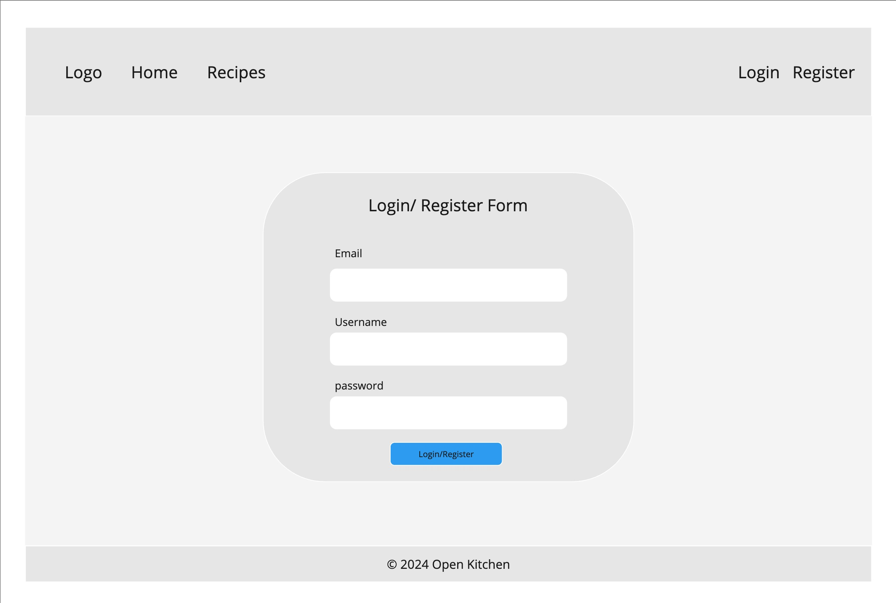
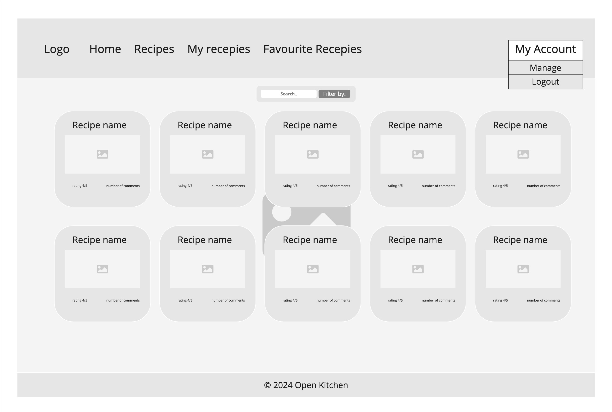
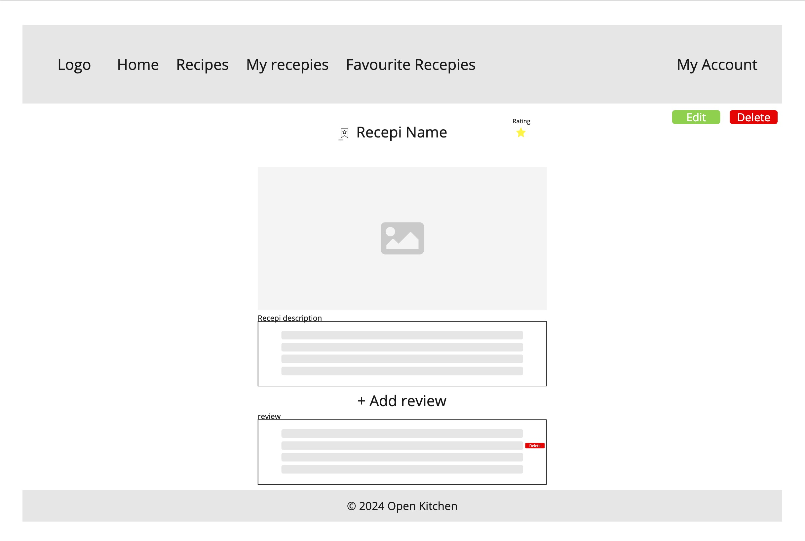
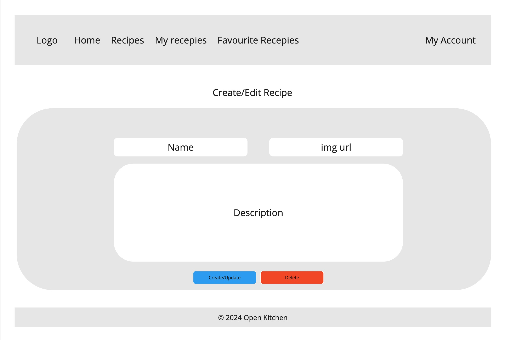
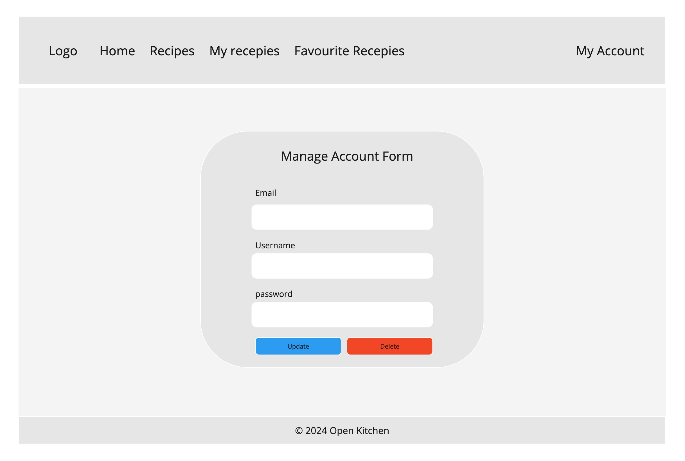
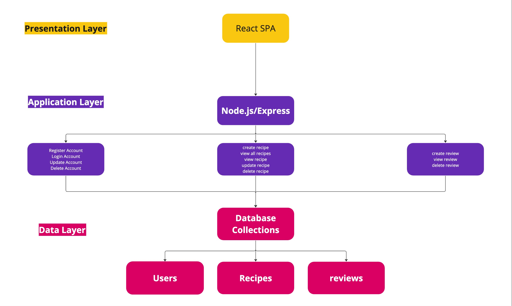

# Open Kitchen

- [Context](#context)
- [Features](#features)
- [User Interface](#user-interface)
- [Architecture](#architecture)
- [RESTful Routing](#restful-routing)
- [Technologies](#technologies)
- [Deployment](#deployment)

Open Kitchen is a full-stack application designed to unite food enthusiasts from around the world. This platform empowers users to share and explore an different variety of recipes, fostering a global community of culinary creativity. Whether you're a seasoned chef eager to showcase your signature dishes or an amateur cook looking for new inspiration, Open Kitchen offers a dynamic space to connect, learn, and share. Users can freely browse a diverse collection of recipes contributed by fellow enthusiasts, enriched with detailed ingredients, step-by-step instructions, and enticing images.

## Context

### The Problem (WHY!):

Many individuals worldwide like cooking and experimenting with new dishes, but lack inspiration and access to different culinary concepts. Whether they are beginner cooks looking for new recipes to try or seasoned chefs wishing to share their masterpieces, there is a clear demand for a platform that centralizes recipe sharing and discovery. Traditional means of recipe discovery, such as cookbooks or general internet searches, can be time-consuming and less engaging.

### The Solution:

This recipe-sharing app intends to provide a community-driven platform where users can easily post their own recipes and discover new ones from other cooking lovers. The app will serve as a one-stop solution for food lovers looking for inspiration, sharing their culinary skills, and engaging with a like-minded community, thanks to its user-friendly UI and effective search functionality. Users can also comment on and rate each other's recipes, which encourages engagement and allows the greatest dishes to be highlighted through community feedback.

### Intended Users (WHO):

Home cooks: People who frequently prepare meals at home and are always on the lookout for interesting new recipes to try.
Aspiring Chefs: Students or enthusiasts in the culinary arts who wish to gain knowledge from a broad range of recipes and methods.
Experienced Chefs: Working chefs and foodies who want to receive comments, be recognized in the culinary industry, and share their special recipes.
Food enthusiasts are anyone who has a strong interest in food, enjoys learning about various cuisines and cooking customs, and connects with a group of people who share their passion.

[Back to index](#open-kitchen)

## Features

### User Management:

**Create an Account:** Users can sign up for a new account by providing necessary information, such as a username, email, and password.

**Login to an Account:** Registered users can log in to their account using their username and password.

**Update an Account:** Users can update their account details, such as their username and password

**Delete an Account:** Users can permanently delete their account and all associated data.

### Recipe Management:

**Create a Recipe:** Users can add a new recipe by providing details such as title, ingredients, instructions, and images.

**View a Recipe:** Users can view detailed information about a specific recipe, including ingredients, instructions, and user comments.

**View All Recipes:** Users can browse and search through all available recipes

**Update a Recipe:** Users can edit their own recipes to update the title, ingredients, instructions, or images.

**Delete a Recipe:** Users can delete their own recipes from the platform.

### Review Management:

**Create a Review:** Users can write and submit a review for a recipe, providing feedback and a rating.

**View All Reviews for a Recipe:** Users can read all reviews and ratings for a specific recipe to gauge its quality and popularity.

**Delete Your Review:** Users can delete their own reviews if they no longer wish to provide feedback on a recipe.

[Back to index](#open-kitchen)

## User Interface

#### Homepage

On the Home page, users can log in or register for an account. If they are not logged in, the only options available in the header are Home, Login, Register, and View All Recipes.

#### View Recipes

This view displays all recipes in a card format, with five cards per row. The layout is consistent for the "My Recipes" and "Favorite Recipes" sections as well.

#### View Single Recipe

When a user clicks on a specific recipe, they are redirected to a page displaying that single recipe with all its details, including the name, image, description, overall rating, and comments. If the user created the recipe option as Edit and Delete will show on the page. If user posted a comment on this recipe he is able to delete his own comment

#### Create/Manage Recipe

This view presents the user the ability to create a new recipe having input fields as name, image url and description, on the edit path users have the ability to edit or delete their recipe with a modal conformation

#### Account Management Page

This view presents the user with editable input fields and an option to permanently delete their account, which includes a confirmation modal to ensure the action is intentional.

[Back to index](#open-kitchen)

## Architecture

[Back to index](#open-kitchen)

## RESTful Routing

### User Routes

**Register account:**

- Request type: POST
- Request URL: `/users`
- Payload: {email: String, username: String, password: String}
- Response:
  - 201: { status: "success", message: "User registered successfully" }
  - 400: { status: "error", message: "User registration failed" }
  - 500: { status: "error", message: "Internal Server Error" }

**Login:**

- Request Type: POST
- Request URL: `/users/login`
- Payload: { email: String, password: String }
- Response:
  - 200: { status: "success", token: "JWT_TOKEN", user: { id: String, username: String, email: String, roles: [String] }}
  - 400: { status: "error", message: "Invalid username or password" }
  - 500: { status: "error", message: "Internal Server Error" }

**Update Account:**

- Request Type: PUT
- Request URL: `/users/:id`
- Headers: { Authorization: "Bearer JWT_TOKEN" }
- Payload: { email: String, username: String, password: String }
- Response:
  - 200: { status: "success", message: "User updated successfully", user: { id: String, username: String, email: String } }
  - 400: { status: "error", message: "User update failed" }
  - 500: { status: "error", message: "Internal Server Error" }

**Delete Account:**

- Request Type: DELETE
- Request URL: `/users/:id`
- Headers: { Authorization: "Bearer JWT_TOKEN" }
- Response:
  - 200: { status: "success", message: "User deleted successfully" }
  - 400: { status: "error", message: "User deletion failed" }
  - 500: { status: "error", message: "Internal Server Error" }

### Recipe Routes

**Create Recipe:**

- Request Type: POST
- Request URL: `/recipes`
- Headers: {Authorization: "Bearer JWT_TOKEN"}
- Payload: {authId: String, name: String, description: String, image: String, reviews: [StingId]}
- Response:
  - 200: { status: "success", message: "Recipe created successfully", {recipe} }
  - 400: { status: "error", message: "Recipe creation failed" }
  - 500: { status: "error", message: "Internal Server Error" }

**View all recipes:**

- Request Type: GET
- Request URL: `/recipes`
- Response:
  - 200: { status: "success", recipes: [ {recipe} ] }
  - 500: { status: "error", message: "Internal Server Error" }

**View Single Recipe:**

- Request Type: GET
- Request URL: `/recipes/:id`
- Response:
  - 200: { status: "success", recipe: {recipe} }
  - 404: { status: "error", message: "Recipe not found" }
  - 500: { status: "error", message: "Internal Server Error" }

**Update Recipe:**

- Request Type: PUT
- Request URL: `/recipes/:id`
- Headers: { Authorization: "Bearer JWT_TOKEN" }
- Payload: { name: String, description: String, image: String }
- Response:
  - 200: { status: "success", message: "Recipe updated successfully", recipe: {updatedRecipe} }
  - 400: { status: "error", message: "Recipe update failed" }
  - 404: { status: "error", message: "Recipe not found" }
  - 500: { status: "error", message: "Internal Server Error" }

**Delete Recipe:**

- Request Type: DELETE
- Request URL: `/recipes/:id`
- Headers: { Authorization: "Bearer JWT_TOKEN" }
- Response:
  - 200: { status: "success", message: "Recipe deleted successfully" }
  - 400: { status: "error", message: "Recipe deletion failed" }
  - 404: { status: "error", message: "Recipe not found" }
  - 500: { status: "error", message: "Internal Server Error" }

### Reviews

**Create Review for Recipe:**

- Request Type: POST
- Request URL: `/recipes/:id/reviews`
- Headers: { Authorization: "Bearer JWT_TOKEN" }
- Payload: { rating: Number, comment: String }
- Response:
  - 201: { status: "success", message: "Review added successfully", review: {review} }
  - 400: { status: "error", message: "Review creation failed" }
  - 404: { status: "error", message: "Recipe not found" }
  - 500: { status: "error", message: "Internal Server Error" }

**View Reviews for Recipe:**

- Request Type: GET
- Request URL: `/recipes/:id/reviews`
- Response:
  - 200: { status: "success", reviews: [ {review} ] }
  - 404: { status: "error", message: "Reviews not found" }
  - 500: { status: "error", message: "Internal Server Error" }

**Delete Review for Recipe:**

- Request Type: DELETE
- Request URL: `/recipes/:recipeId/reviews/:reviewId`
- Headers: { Authorization: "Bearer JWT_TOKEN" }
- Response:
  - 200: { status: "success", message: "Review deleted successfully" }
  - 400: { status: "error", message: "Review deletion failed" }
  - 404: { status: "error", message: "Recipe or Review not found" }
  - 500: { status: "error", message: "Internal Server Error" }

[Back to index](#open-kitchen)

## Technologies

### Frontend

#### Dependencies:

- React
- React-dom
- React-router-dom
- axios
- Bootstrap
- Material UI

#### Dev Dependencies:

- Testing Library
- Vitest
- c8
- Sinon
- Vite

### Backend

#### Dependencies:

- express
- NodeJS
- Cors
- mongodb
- mongoose
- express-validator
- bcrypt
- dotenv
- jwt

#### Dev Dependencies:

- Supertest
- Sinon
- Mocha
- Jest
- Chai

[Back to index](#open-kitchen)

## Deployment

I plan to deploy the frontend of my application on Netlify, leveraging its easy-to-use platform for static website hosting and SPAs. For the backend, I am considering either MongoDB Atlas or Render. I'll have a production environment for deployment

[Back to index](#open-kitchen)
